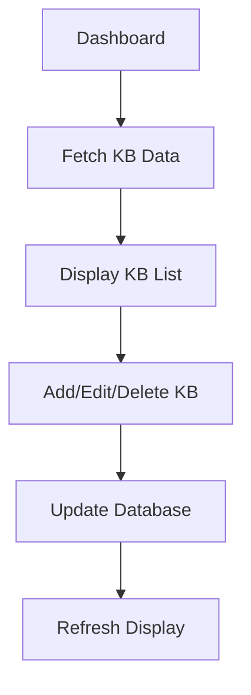
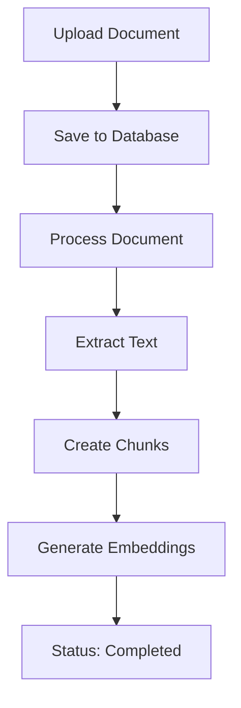
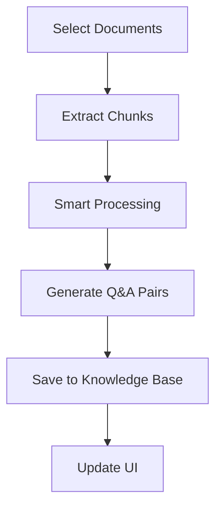

# 🤖 โครงสร้าง API และการเชื่อมโยง Chatbot Dashboard

## 📍 URL: `/dashboard/chatbot`

### 🏗️ โครงสร้างหน้า Dashboard Chatbot

```
src/app/dashboard/chatbot/page.tsx
├── ChatInterface Component
├── Knowledge Base Management
├── Document Upload & Processing
└── RAG to Knowledge Base Conversion
```

## 🔗 API Endpoints ที่เชื่อมโยง

### 1. **Knowledge Base APIs**
```
GET    /api/chatbot/knowledge-base          # ดึงข้อมูล KB ทั้งหมด
POST   /api/chatbot/knowledge-base          # เพิ่ม KB ใหม่
DELETE /api/chatbot/knowledge-base/[id]     # ลบ KB
```

### 2. **Document Management APIs**
```
GET    /api/chatbot/documents               # ดึงรายการเอกสาร RAG
POST   /api/chatbot/upload-simple           # อัพโหลดเอกสาร
DELETE /api/chatbot/documents/[id]          # ลบเอกสาร
```

### 3. **Chat APIs**
```
POST   /api/chatbot/chat                    # ส่งข้อความแชท
GET    /api/chatbot/chat?sessionId=xxx      # ดึงประวัติแชท
```

### 4. **Processing APIs**
```
POST   /api/chatbot/import                  # นำเข้าจาก Excel
POST   /api/chatbot/convert-rag             # แปลง RAG เป็น KB
POST   /api/chatbot/bulk-convert            # แปลงทั้งหมด
POST   /api/chatbot/smart-convert           # แปลงอัจฉริยะ
POST   /api/chatbot/generate-embeddings     # สร้าง AI Embeddings
```

## 📊 โครงสร้างข้อมูล (Data Structure)

### Knowledge Base Interface
```typescript
interface KnowledgeBase {
  id: string
  question: string
  answer: string
  category: string
  courseId?: string
  isActive: boolean
  createdAt: string
}
```

### Document Interface
```typescript
interface Document {
  id: string
  filename: string
  fileType: string
  status: string          // 'processing' | 'completed' | 'failed'
  totalChunks: number
  createdAt: string
}
```

### Chat Message Interface
```typescript
interface Message {
  id: string
  text: string
  isBot: boolean
  timestamp: Date
  sources?: Array<{
    source: string
    content: string
    similarity?: number
  }>
}
```

## 🔄 การทำงานของระบบ

### 1. **Knowledge Base Management**


### 2. **Document Processing Flow**


### 3. **RAG to Knowledge Base Conversion**


## 🎯 ฟีเจอร์หลัก

### 📚 **Knowledge Base Management**
- ✅ แสดงรายการ KB ทั้งหมด
- ✅ เพิ่ม/ลบ KB แบบ Manual
- ✅ นำเข้าจาก Excel Template
- ✅ จัดหมวดหมู่ (general, course, pricing, technical)

### 📄 **Document Management**
- ✅ อัพโหลดเอกสาร (PDF, TXT, DOCX, DOC)
- ✅ แสดงสถานะการประมวลผล
- ✅ ลบเอกสารที่ไม่ต้องการ
- ✅ ตรวจสอบจำนวน chunks

### 🤖 **AI Processing**
- ✅ สร้าง Embeddings อัตโนมัติ
- ✅ แปลง RAG เป็น Knowledge Base
- ✅ การแปลงแบบอัจฉริยะ (Smart Convert)
- ✅ การแปลงทั้งหมด (Bulk Convert)

### 💬 **Chat Interface**
- ✅ ทดสอบ Chatbot แบบ Real-time
- ✅ แสดงแหล่งข้อมูล (Sources)
- ✅ บันทึกประวัติการสนทนา
- ✅ แสดงเปอร์เซ็นต์ความแม่นยำ

## 🔧 การเชื่อมโยงกับระบบอื่น

### 1. **Database Tables**
```sql
-- Knowledge Base
chat_knowledge_base
├── id (Primary Key)
├── question
├── answer
├── category
├── courseId (Foreign Key)
├── isActive
└── createdAt

-- RAG Documents
rag_documents
├── id (Primary Key)
├── filename
├── fileType
├── status
├── totalChunks
└── createdAt

-- RAG Chunks
rag_chunks
├── id (Primary Key)
├── documentId (Foreign Key)
├── content
├── embedding
└── chunkIndex

-- Chat Sessions
chat_sessions
├── id (Primary Key)
├── sessionId
├── userId (Foreign Key)
└── createdAt

-- Chat Messages
chat_messages
├── id (Primary Key)
├── sessionId (Foreign Key)
├── message
├── isBot
└── createdAt
```

### 2. **External Services**
- 🔗 **Prisma ORM** - Database Operations
- 🔗 **File Upload** - Document Processing
- 🔗 **AI Embeddings** - Vector Search
- 🔗 **Fuzzy Matching** - Question Similarity

## 📱 UI Components ที่ใช้

### 1. **Main Components**
```typescript
// หลัก
ChatInterface              // แชทบอท
ChatbotErrorHandler       // จัดการข้อผิดพลาด

// UI Components
Card, CardContent, CardHeader, CardTitle
Button, Input
Upload, Download, Trash2, Edit, Plus
FileText, AlertCircle, MessageSquare
```

### 2. **State Management**
```typescript
const [knowledgeBase, setKnowledgeBase] = useState<KnowledgeBase[]>([])
const [documents, setDocuments] = useState<Document[]>([])
const [loading, setLoading] = useState(false)
const [uploadLoading, setUploadLoading] = useState(false)
const [convertLoading, setConvertLoading] = useState(false)
const [selectedDocs, setSelectedDocs] = useState<string[]>([])
```

## 🚀 การปรับปรุงและเพิ่มประสิทธิภาพ

### 1. **Performance Optimizations**
- ⚡ Ultra-fast RAG processing
- 🔄 Async conversation saving
- 📊 Pagination for large datasets
- 🎯 Smart caching strategies

### 2. **Error Handling**
- 🛡️ Comprehensive error boundaries
- 📝 Detailed error messages
- 🔄 Automatic retry mechanisms
- 📊 Error logging and monitoring

### 3. **User Experience**
- 🎨 Real-time status updates
- 📱 Mobile-responsive design
- ⌨️ Keyboard shortcuts
- 🔔 Success/error notifications

## 🔍 การ Debug และ Troubleshooting

### 1. **Common Issues**
```javascript
// ปัญหา: "map is not a function"
// สาเหตุ: ข้อมูลที่ได้รับไม่ใช่ Array
// แก้ไข: ตรวจสอบ API response และใช้ Array.isArray()

// ปัญหา: Chat ไม่ตอบ
// สาเหตุ: ไม่มี Knowledge Base หรือ RAG data
// แก้ไข: เพิ่มข้อมูลหรือแปลงเอกสาร

// ปัญหา: Upload ล้มเหลว
// สาเหตุ: ไฟล์ใหญ่เกินไปหรือประเภทไม่รองรับ
// แก้ไข: ตรวจสอบขนาดและประเภทไฟล์
```

### 2. **Debug Tools**
- 🔧 Browser Console Logs
- 📊 Network Tab Monitoring
- 🗄️ Database Query Inspection
- 📝 API Response Validation

## 📈 Metrics และ Analytics

### 1. **Performance Metrics**
- ⏱️ Response Time Tracking
- 📊 Success/Failure Rates
- 💾 Database Query Performance
- 🔄 Conversion Success Rates

### 2. **Usage Analytics**
- 👥 Active Users Count
- 💬 Messages per Session
- 📚 Most Asked Questions
- 🎯 Knowledge Base Effectiveness

---

**📝 หมายเหตุ**: โครงสร้างนี้ออกแบบมาเพื่อความยืดหยุ่นและขยายได้ง่าย รองรับการเพิ่มฟีเจอร์ใหม่ในอนาคต