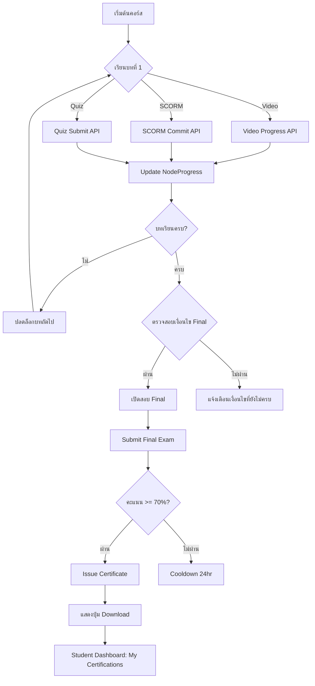

# 🎓 LMS Complete Implementation Guide
## แนวทาง LMS ครบวงจร: Learning Path + Progress Tracking + SCORM/Video/Quiz + Final Exam + Certification

> **เอกสารนี้รวมทุกอย่างที่ต้องใช้ในการสร้าง LMS แบบ enterprise-grade**  
> ตั้งแต่ Database Schema, API Routes, Business Logic, จนถึง Frontend Implementation

---

## 📋 สารบัญ

1. [โครงสร้างการเรียนรู้ (Learning Path Architecture)](#1-โครงสร้างการเรียนรู้)
2. [การบันทึกความคืบหน้า (Progress Tracking Engine)](#2-การบันทึกความคืบหน้า)
3. [SCORM Tracking System](#3-scorm-tracking-system)
4. [Video Tracking System](#4-video-tracking-system)
5. [Quiz & Assessment System](#5-quiz--assessment-system)
6. [เงื่อนไขสอบ Final (Final Exam Gating)](#6-เงื่อนไขสอบ-final)
7. [Certification System](#7-certification-system)
8. [Complete Flow Diagram](#8-complete-flow-diagram)
9. [API Reference](#9-api-reference)
10. [Frontend Implementation Examples](#10-frontend-implementation-examples)

---

## 1. โครงสร้างการเรียนรู้

### 1.1 Database Schema

```prisma
model Course {
  id            String              @id @default(cuid())
  title         String
  description   String?
  modules       Module[]            // หมวดหมู่ย่อย
  learningNodes LearningNode[]      // Graph-based learning path
}

model Module {
  id        String   @id @default(cuid())
  title     String
  order     Int
  courseId  String
  lessons   Lesson[]
}

model Lesson {
  id                           String   @id @default(cuid())
  courseId                     String
  moduleId                     String?
  lessonType                   String   // 'VIDEO', 'SCORM', 'QUIZ', 'INTERACTIVE'
  order                        Int
  title                        String?
  youtubeUrl                   String?
  launchUrl                    String?
  requiredCompletionPercentage Int      @default(80)
  duration                     Float?
  isFinalExam                  Boolean  @default(false)
  
  scormPackage                 ScormPackage?
  watchHistory                 WatchHistory[]
}

// Graph-based Learning Path (DAG Architecture)
model LearningNode {
  id                String             @id @default(cuid())
  courseId          String
  nodeType          String             // 'VIDEO', 'SCORM', 'QUIZ'
  refId             String             // lessonId or quizId
  title             String
  order             Int                @default(0)
  
  // Completion Criteria
  requiredScore     Int?               // For QUIZ (เช่น 70%)
  requiredProgress  Float?             // For VIDEO/SCORM (เช่น 0.8 = 80%)
  requiredDuration  Int?               // Minimum time (seconds)
  
  isFinalExam       Boolean            @default(false)
  isOptional        Boolean            @default(false)
  
  // Relations
  dependenciesFrom  NodeDependency[]   @relation("DependencyFrom")
  dependenciesTo    NodeDependency[]   @relation("DependencyTo")
  progress          NodeProgress[]
}

// Graph Edges (Prerequisites)
model NodeDependency {
  id             String       @id @default(cuid())
  fromNodeId     String       // บทเรียนที่ต้องเรียนก่อน
  toNodeId       String       // บทเรียนที่จะปลดล็อก
  dependencyType String       @default("AND") // 'AND', 'OR'
  
  fromNode       LearningNode @relation("DependencyFrom", ...)
  toNode         LearningNode @relation("DependencyTo", ...)
}
```

### 1.2 Sequencing Logic (ลำดับการเรียน)

**วิธีการกำหนด Prerequisite:**

```typescript
// สร้าง Learning Path แบบ Sequential
async function createSequentialPath(courseId: string, lessonIds: string[]) {
  const nodes = await Promise.all(
    lessonIds.map((lessonId, index) => 
      prisma.learningNode.create({
        data: {
          courseId,
          nodeType: 'VIDEO', 
          refId: lessonId,
          title: `Lesson ${index + 1}`,
          order: index,
          requiredProgress: 0.8 // ต้องดูวิดีโอ 80%
        }
      })
    )
  )
  
  // สร้าง Dependencies (บทที่ 1 → บทที่ 2 → บทที่ 3)
  for (let i = 0; i < nodes.length - 1; i++) {
    await prisma.nodeDependency.create({
      data: {
        fromNodeId: nodes[i].id,      // บทปัจจุบัน
        toNodeId: nodes[i + 1].id,    // บทถัดไป
        dependencyType: 'AND'
      }
    })
  }
}
```

**เงื่อนไขการปลดล็อก (Unlock Conditions):**

| เงื่อนไข | ตัวอย่าง |
|---------|----------|
| ดูวิดีโอครบ ≥ 80% | `requiredProgress: 0.8` |
| Quiz ผ่าน ≥ 70% | `requiredScore: 70` |
| เรียนบทก่อนหน้า Complete | `NodeDependency` |

---

## 2. การบันทึกความคืบหน้า

### 2.1 Progress Engine Architecture

```typescript
// Progress States
enum NodeStatus {
  NOT_STARTED = 'NOT_STARTED',
  IN_PROGRESS = 'IN_PROGRESS',
  COMPLETED = 'COMPLETED',
  FAILED = 'FAILED'
}

model NodeProgress {
  id              String   @id @default(cuid())
  userId          String
  nodeId          String
  courseId        String
  
  status          String   @default("NOT_STARTED")
  progressPercent Float    @default(0)      // 0-100
  score           Float?                    // คะแนน (สำหรับ quiz)
  timeSpent       Int      @default(0)      // วินาที
  
  startedAt       DateTime?
  completedAt     DateTime?
  lastActivityAt  DateTime @default(now())
  
  // Type-specific data (JSON)
  metadata        Json?    // { "videoSegments": [...], "scormCmi": {...} }
  
  @@unique([userId, nodeId])
}
```

### 2.2 Event-Driven Progress Updates

**Events ที่ต้องเก็บ:**

```typescript
// 1. lesson_started
await updateProgress({
  userId,
  nodeId,
  status: 'IN_PROGRESS',
  startedAt: new Date()
})

// 2. lesson_progress_updated (เช่น video ดูไปแล้ว 45%)
await updateProgress({
  userId,
  nodeId,
  progressPercent: 45,
  lastActivityAt: new Date()
})

// 3. lesson_completed
await updateProgress({
  userId,
  nodeId,
  status: 'COMPLETED',
  progressPercent: 100,
  completedAt: new Date()
})

// 4. quiz_attempt_submitted
await createQuizAttempt({
  userId,
  quizId,
  score: 85,
  passed: true
})

// 5. scorm_committed
await updateScormData({
  userId,
  lessonId,
  completionStatus: 'completed',
  scoreRaw: 95
})
```

### 2.3 Course Progress Calculation

```typescript
async function calculateCourseProgress(userId: string, courseId: string) {
  const nodes = await prisma.learningNode.findMany({
    where: { courseId },
    include: {
      progress: {
        where: { userId }
      }
    }
  })
  
  const totalNodes = nodes.length
  const completedNodes = nodes.filter(node => 
    node.progress[0]?.status === 'COMPLETED'
  ).length
  
  const percentage = (completedNodes / totalNodes) * 100
  
  return {
    totalNodes,
    completedNodes,
    percentage: Math.round(percentage),
    isComplete: percentage === 100
  }
}
```

---

## 3. SCORM Tracking System

### 3.1 Database Schema

```prisma
model ScormPackage {
  id          String   @id @default(cuid())
  lessonId    String   @unique
  packagePath String          // URL หรือ path ไปยัง SCORM package
  manifest    String?         // imsmanifest.xml content
  version     String   @default("1.2") // '1.2' or '2004'
  title       String?
  identifier  String?
}

model ScormRuntimeData {
  id               String   @id @default(cuid())
  userId           String
  lessonId         String
  
  // CMI Core Data (SCORM 1.2)
  completionStatus String?  // 'completed', 'incomplete', 'not attempted'
  successStatus    String?  // 'passed', 'failed', 'unknown'
  scoreRaw         Float?
  scoreMin         Float?
  scoreMax         Float?
  totalTime        String?  // ISO 8601 duration (PT1H30M)
  
  // Session Data
  sessionTime      String?
  suspendData      String?  @db.Text
  location         String?  // Bookmark location
  
  // Full CMI dump
  cmiData          Json?
  
  lastCommit       DateTime @default(now())
  
  @@unique([userId, lessonId])
}
```

### 3.2 SCORM API Flow

```typescript
// 1. ผู้เรียนกดเข้า SCORM → Initialize
POST /api/scorm/init
{
  "userId": "user_123",
  "lessonId": "lesson_456"
}

// Response: โหลดค่าเดิม (resume)
{
  "registrationId": "reg_789",
  "cmiData": {
    "cmi.core.lesson_status": "incomplete",
    "cmi.core.score.raw": "75",
    "cmi.suspend_data": "bookmark_chapter_3"
  }
}

// 2. SCORM Player ส่งค่าขึ้นมา (Commit)
POST /api/scorm/commit
{
  "registrationId": "reg_789",
  "cmiData": {
    "cmi.core.lesson_status": "completed",
    "cmi.core.score.raw": "95",
    "cmi.core.total_time": "PT45M",
    "cmi.core.lesson_location": "end"
  }
}

// 3. LMS อัปเดต NodeProgress
await prisma.nodeProgress.update({
  where: { userId_nodeId: { userId, nodeId } },
  data: {
    status: 'COMPLETED',
    progressPercent: 100,
    score: 95,
    completedAt: new Date()
  }
})
```

### 3.3 Completion Criteria

**เงื่อนไข Complete สำหรับ SCORM:**

```typescript
function isScormCompleted(scormData: ScormRuntimeData): boolean {
  // SCORM 2004
  if (scormData.version === '2004') {
    return (
      scormData.completionStatus === 'completed' &&
      (scormData.successStatus === 'passed' || scormData.successStatus === 'unknown')
    )
  }
  
  // SCORM 1.2
  const status = scormData.cmiData?.['cmi.core.lesson_status']
  return status === 'completed' || status === 'passed'
}
```

---

## 4. Video Tracking System

### 4.1 Database Schema

```prisma
model WatchHistory {
  id        String   @id @default(cuid())
  userId    String
  lessonId  String
  watchTime Float    @default(0)  // วินาทีที่ดูจริง
  totalTime Float    @default(0)  // ความยาววิดีโอทั้งหมด
  completed Boolean  @default(false)
  updatedAt DateTime @updatedAt
  
  @@unique([userId, lessonId])
}

// Anti-Skip Tracking (ป้องกันการลาก)
model VideoSegment {
  id        String   @id @default(cuid())
  userId    String
  lessonId  String
  startTime Float    // วินาทีเริ่มต้น
  endTime   Float    // วินาทีสิ้นสุด
  watchedAt DateTime @default(now())
  
  @@index([userId, lessonId])
}
```

### 4.2 Video Progress API

```typescript
// Frontend ส่ง progress ทุก 5-10 วินาที
POST /api/video/progress
{
  "userId": "user_123",
  "lessonId": "lesson_456",
  "currentTime": 125.5,      // ตำแหน่งปัจจุบัน (วินาที)
  "duration": 600,           // ความยาวทั้งหมด
  "watchedSegment": {        // ช่วงที่ดูในครั้งนี้
    "start": 120,
    "end": 125.5
  }
}

// Backend Logic
async function updateVideoProgress(data) {
  // 1. บันทึก segment (anti-skip)
  await prisma.videoSegment.create({
    data: {
      userId: data.userId,
      lessonId: data.lessonId,
      startTime: data.watchedSegment.start,
      endTime: data.watchedSegment.end
    }
  })
  
  // 2. คำนวณเวลาที่ดูจริงๆ (รวม segments ที่ไม่ซ้ำกัน)
  const segments = await prisma.videoSegment.findMany({
    where: {
      userId: data.userId,
      lessonId: data.lessonId
    }
  })
  
  const totalWatchedTime = calculateUniqueWatchTime(segments)
  const percentage = (totalWatchedTime / data.duration) * 100
  
  // 3. Update WatchHistory
  await prisma.watchHistory.upsert({
    where: {
      userId_lessonId: {
        userId: data.userId,
        lessonId: data.lessonId
      }
    },
    update: {
      watchTime: totalWatchedTime,
      totalTime: data.duration,
      completed: percentage >= 80 // ดู >= 80% ถือว่า complete
    },
    create: {
      userId: data.userId,
      lessonId: data.lessonId,
      watchTime: totalWatchedTime,
      totalTime: data.duration,
      completed: false
    }
  })
  
  // 4. Update NodeProgress
  if (percentage >= 80) {
    await updateNodeProgress({
      userId: data.userId,
      lessonId: data.lessonId,
      status: 'COMPLETED',
      progressPercent: 100
    })
  }
}

// Helper: รวม segments ที่ไม่ซ้ำกัน
function calculateUniqueWatchTime(segments) {
  // เรียงตามเวลา
  segments.sort((a, b) => a.startTime - b.startTime)
  
  let totalTime = 0
  let currentEnd = 0
  
  for (const seg of segments) {
    if (seg.startTime > currentEnd) {
      // ช่วงใหม่
      totalTime += (seg.endTime - seg.startTime)
      currentEnd = seg.endTime
    } else if (seg.endTime > currentEnd) {
      // ช่วงทับซ้อน
      totalTime += (seg.endTime - currentEnd)
      currentEnd = seg.endTime
    }
  }
  
  return totalTime
}
```

### 4.3 Completion Criteria

```typescript
// เงื่อนไข Complete สำหรับ Video
const VIDEO_COMPLETE_THRESHOLD = 80 // %

function isVideoCompleted(watchHistory: WatchHistory): boolean {
  const percentage = (watchHistory.watchTime / watchHistory.totalTime) * 100
  return percentage >= VIDEO_COMPLETE_THRESHOLD
}
```

---

## 5. Quiz & Assessment System

### 5.1 Database Schema

```prisma
model Quiz {
  id               String   @id @default(cuid())
  title            String
  courseId         String?
  timeLimit        Int?     @default(0)      // นาที
  passScore        Int      @default(70)     // % ที่ต้องได้เพื่อผ่าน
  randomize        Boolean  @default(false)  // สุ่มข้อ
  questionsToShow  Int?                      // จำนวนข้อที่จะแสดง
  
  questions        Question[]
  attemptRecords   QuizAttemptRecord[]
}

model Question {
  id            String         @id @default(cuid())
  text          String
  type          String         @default("MULTIPLE_CHOICE")
  quizId        String
  order         Int
  correctAnswer String?
  options       AnswerOption[]
}

model QuizAttemptRecord {
  id            String   @id @default(cuid())
  userId        String
  quizId        String
  nodeId        String?  // Link to LearningNode
  
  attemptNumber Int
  score         Float
  passed        Boolean
  answers       Json     // คำตอบที่ส่ง (encrypted)
  
  startedAt     DateTime
  submittedAt   DateTime @default(now())
  timeSpent     Int      // วินาที
  
  // Anti-cheat
  ipAddress     String?
  userAgent     String?
  
  @@index([userId, quizId, submittedAt])
}
```

### 5.2 Quiz Submission Flow

```typescript
POST /api/quiz/submit
{
  "userId": "user_123",
  "quizId": "quiz_456",
  "lessonId": "lesson_789",
  "answers": [
    { "questionId": "q1", "selectedOption": "option_a" },
    { "questionId": "q2", "selectedOption": "option_c" }
  ],
  "timeSpent": 300  // วินาที
}

// Backend Processing
async function submitQuiz(data) {
  // 1. ดึงข้อมูล Quiz + Questions
  const quiz = await prisma.quiz.findUnique({
    where: { id: data.quizId },
    include: {
      questions: {
        include: { options: true }
      }
    }
  })
  
  // 2. ตรวจคำตอบ
  let correctCount = 0
  const results = data.answers.map(answer => {
    const question = quiz.questions.find(q => q.id === answer.questionId)
    const isCorrect = question.correctAnswer === answer.selectedOption
    if (isCorrect) correctCount++
    
    return {
      questionId: answer.questionId,
      isCorrect,
      selectedOption: answer.selectedOption,
      correctAnswer: question.correctAnswer
    }
  })
  
  // 3. คำนวณคะแนน
  const score = (correctCount / quiz.questions.length) * 100
  const passed = score >= quiz.passScore
  
  // 4. บันทึก Attempt
  const attemptNumber = await getNextAttemptNumber(data.userId, data.quizId)
  
  await prisma.quizAttemptRecord.create({
    data: {
      userId: data.userId,
      quizId: data.quizId,
      nodeId: data.nodeId,
      attemptNumber,
      score,
      passed,
      answers: results,
      startedAt: new Date(Date.now() - data.timeSpent * 1000),
      submittedAt: new Date(),
      timeSpent: data.timeSpent
    }
  })
  
  // 5. Update NodeProgress (ถ้าผ่าน)
  if (passed) {
    await prisma.nodeProgress.update({
      where: {
        userId_nodeId: {
          userId: data.userId,
          nodeId: data.nodeId
        }
      },
      data: {
        status: 'COMPLETED',
        score,
        completedAt: new Date()
      }
    })
  }
  
  return {
    score,
    passed,
    feedback: `คุณได้ ${correctCount}/${quiz.questions.length} ข้อ (${score.toFixed(1)}%)`,
    results
  }
}
```

### 5.3 Quiz Attempt Limits

```typescript
// จำกัดจำนวนครั้งที่สอบได้
const MAX_ATTEMPTS = 3

async function canTakeQuiz(userId: string, quizId: string): Promise<boolean> {
  const attempts = await prisma.quizAttemptRecord.count({
    where: { userId, quizId }
  })
  
  return attempts < MAX_ATTEMPTS
}

// Cooldown (ต้องรอ 24 ชม. หลังตก)
async function getNextAvailableAttempt(userId: string, quizId: string) {
  const lastAttempt = await prisma.quizAttemptRecord.findFirst({
    where: { userId, quizId, passed: false },
    orderBy: { submittedAt: 'desc' }
  })
  
  if (!lastAttempt) return new Date()
  
  const cooldownHours = 24
  const nextAvailable = new Date(lastAttempt.submittedAt)
  nextAvailable.setHours(nextAvailable.getHours() + cooldownHours)
  
  return nextAvailable
}
```

---

## 6. เงื่อนไขสอบ Final

### 6.1 Final Exam Gating

```typescript
// เงื่อนไขก่อนเข้าสอบ Final
async function canTakeFinalExam(userId: string, courseId: string) {
  // 1. ต้องเรียนครบ 100% (หรือตั้งเป็น 90%)
  const progress = await calculateCourseProgress(userId, courseId)
  
  if (progress.percentage < 100) {
    return {
      allowed: false,
      reason: `คุณเรียนไปแล้ว ${progress.percentage}% ต้องเรียนครบ 100% ก่อน`
    }
  }
  
  // 2. ต้องผ่าน Quiz บทสำคัญ (optional)
  const requiredQuizzes = await prisma.learningNode.findMany({
    where: {
      courseId,
      nodeType: 'QUIZ',
      metadata: {
        path: ['isRequired'],
        equals: true
      }
    }
  })
  
  for (const node of requiredQuizzes) {
    const nodeProgress = await prisma.nodeProgress.findUnique({
      where: {
        userId_nodeId: {
          userId,
          nodeId: node.id
        }
      }
    })
    
    if (!nodeProgress || nodeProgress.status !== 'COMPLETED') {
      return {
        allowed: false,
        reason: `คุณยังไม่ผ่าน Quiz: ${node.title}`
      }
    }
  }
  
  // 3. ตรวจสอบ project assignment (ถ้ามี)
  // ... (ขยายเพิ่มเติมได้)
  
  return { allowed: true }
}
```

### 6.2 Final Exam Submission

```typescript
POST /api/final-exam/submit
{
  "userId": "user_123",
  "courseId": "course_456",
  "finalExamId": "quiz_789",
  "answers": [...]
}

async function submitFinalExam(data) {
  // 1. ตรวจสอบสิทธิ์
  const canTake = await canTakeFinalExam(data.userId, data.courseId)
  if (!canTake.allowed) {
    throw new Error(canTake.reason)
  }
  
  // 2. ส่งข้อสอบ (ใช้ logic เดียวกับ quiz)
  const result = await submitQuiz({
    userId: data.userId,
    quizId: data.finalExamId,
    answers: data.answers
  })
  
  // 3. ถ้าผ่าน → ออกใบ Certificate
  if (result.passed) {
    const certificate = await issueCertificate(data.userId, data.courseId, {
      finalScore: result.score
    })
    
    return {
      ...result,
      certificate
    }
  }
  
  return result
}
```

---

## 7. Certification System

### 7.1 Database Schema

```prisma
model CourseCertificateDefinition {
  id           String   @id @default(cuid())
  courseId     String   @unique
  templateHtml String   // HTML template
  issuerName   String   @default("SkillNexus Academy")
  issuerTitle  String   @default("Learning Management System")
  expiryMonths Int?     // null = never expires
  isActive     Boolean  @default(true)
  
  certificates CourseCertificate[]
}

model CourseCertificate {
  id               String   @id @default(cuid())
  userId           String
  courseId         String
  verificationCode String   @unique @default(cuid())
  issueDate        DateTime @default(now())
  expiryDate       DateTime?
  status           String   @default("ACTIVE") // 'ACTIVE', 'REVOKED'
  pdfUrl           String?
  
  @@unique([userId, courseId])
  @@index([verificationCode])
}

model CertificateFile {
  id              String   @id @default(cuid())
  userId          String
  courseId        String
  certificateType String   // 'COURSE_COMPLETION'
  verificationId  String   @unique
  pdfUrl          String
  pdfHash         String   // SHA-256 (anti-tamper)
  issuerName      String
  recipientName   String
  issueDate       DateTime @default(now())
  status          String   @default("ACTIVE")
}
```

### 7.2 Certificate Issuance Flow

```typescript
async function issueCertificate(
  userId: string, 
  courseId: string, 
  metadata?: { finalScore?: number }
) {
  // 1. ตรวจสอบว่าเคยออกให้แล้วหรือยัง
  const existing = await prisma.courseCertificate.findUnique({
    where: {
      userId_courseId: {
        userId,
        courseId
      }
    }
  })
  
  if (existing) {
    return existing // ไม่ออกซ้ำ
  }
  
  // 2. ดึง template
  const definition = await prisma.courseCertificateDefinition.findUnique({
    where: { courseId }
  })
  
  if (!definition || !definition.isActive) {
    throw new Error('ไม่มี certificate template สำหรับคอร์สนี้')
  }
  
  // 3. ดึงข้อมูลผู้เรียน + คอร์ส
  const user = await prisma.user.findUnique({ where: { id: userId } })
  const course = await prisma.course.findUnique({ where: { id: courseId } })
  
  // 4. สร้าง certificate record
  const verificationCode = generateVerificationCode()
  const expiryDate = definition.expiryMonths
    ? addMonths(new Date(), definition.expiryMonths)
    : null
  
  const certificate = await prisma.courseCertificate.create({
    data: {
      userId,
      courseId,
      definitionId: definition.id,
      verificationCode,
      issueDate: new Date(),
      expiryDate,
      status: 'ACTIVE'
    }
  })
  
  // 5. Generate PDF (background job)
  const pdfUrl = await generateCertificatePDF({
    template: definition.templateHtml,
    data: {
      recipientName: user.name,
      courseName: course.title,
      issueDate: new Date().toLocaleDateString('th-TH'),
      verificationCode,
      issuerName: definition.issuerName,
      qrCodeUrl: `${process.env.APP_URL}/verify/${verificationCode}`
    }
  })
  
  // 6. Update PDF URL
  await prisma.courseCertificate.update({
    where: { id: certificate.id },
    data: { pdfUrl }
  })
  
  // 7. Emit event (for notifications, etc.)
  await prisma.certificationEvent.create({
    data: {
      eventType: 'CERTIFICATE_ISSUED',
      userId,
      entityType: 'COURSE_CERTIFICATE',
      entityId: certificate.id,
      metadata: JSON.stringify({
        courseName: course.title,
        verificationCode
      })
    }
  })
  
  return certificate
}
```

### 7.3 Student Dashboard (My Certifications)

```typescript
// API: GET /api/student/certifications
GET /api/student/certifications?userId=user_123

// Response
{
  "courseCertificates": [
    {
      "id": "cert_001",
      "courseName": "AI & Machine Learning Fundamentals",
      "issueDate": "2024-01-15",
      "verificationCode": "ABC123XYZ",
      "pdfUrl": "/api/certificates/cert_001/download",
      "verifyUrl": "/verify/ABC123XYZ"
    }
  ],
  "careerCertificates": []
}
```

### 7.4 Download Certificate

```typescript
// API: GET /api/certificates/:certificateId/download
GET /api/certificates/cert_001/download

// Implementation
export async function GET(
  request: Request,
  { params }: { params: { certificateId: string } }
) {
  const certificate = await prisma.courseCertificate.findUnique({
    where: { id: params.certificateId },
    include: {
      user: true,
      course: true,
      definition: true
    }
  })
  
  if (!certificate) {
    return new Response('Certificate not found', { status: 404 })
  }
  
  // Return PDF file
  const pdfBuffer = await fetch(certificate.pdfUrl).then(r => r.arrayBuffer())
  
  return new Response(pdfBuffer, {
    headers: {
      'Content-Type': 'application/pdf',
      'Content-Disposition': `attachment; filename="Certificate_${certificate.course.title}.pdf"`
    }
  })
}
```

### 7.5 Public Verification

```typescript
// API: GET /api/verify/:code
GET /api/verify/ABC123XYZ

// Response
{
  "valid": true,
  "certificateData": {
    "recipientName": "Somchai Jaidee",
    "courseName": "AI & Machine Learning Fundamentals",
    "issuerName": "SkillNexus Academy",
    "issueDate": "15 มกราคม 2567",
    "expiryDate": null,
    "status": "ACTIVE"
  }
}
```

---

## 8. Complete Flow Diagram



---

## 9. API Reference

### 9.1 Progress APIs

| Method | Endpoint | Description |
|--------|----------|-------------|
| `POST` | `/api/video/progress` | อัพเดทความคืบหน้าวิดีโอ |
| `POST` | `/api/scorm/init` | Initialize SCORM session |
| `POST` | `/api/scorm/commit` | บันทึกข้อมูล SCORM |
| `POST` | `/api/quiz/submit` | ส่งคำตอบ Quiz |
| `GET` | `/api/courses/:courseId/progress` | ดูความคืบหน้าคอร์ส |
| `POST` | `/api/courses/:courseId/lessons/:lessonId/complete` | Mark lesson complete |

### 9.2 Final Exam APIs

| Method | Endpoint | Description |
|--------|----------|-------------|
| `GET` | `/api/final-exam/eligibility` | ตรวจสอบสิทธิ์สอบ Final |
| `POST` | `/api/final-exam/submit` | ส่งข้อสอบ Final |
| `GET` | `/api/final-exam/attempts` | ดูประวัติการสอบ |

### 9.3 Certificate APIs

| Method | Endpoint | Description |
|--------|----------|-------------|
| `POST` | `/api/certificates/issue` | ออกใบ Certificate |
| `GET` | `/api/certificates/:id/download` | ดาวน์โหลด PDF |
| `GET` | `/api/student/certifications` | รายการใบที่ได้รับ |
| `GET` | `/api/verify/:code` | ตรวจสอบความถูกต้อง |

---

## 10. Frontend Implementation Examples

### 10.1 Video Player with Progress Tracking

```tsx
'use client'

import { useRef, useEffect } from 'react'

export function VideoPlayer({ lessonId, videoUrl }) {
  const videoRef = useRef<HTMLVideoElement>(null)
  
  useEffect(() => {
    const video = videoRef.current
    if (!video) return
    
    // Track progress every 5 seconds
    const interval = setInterval(async () => {
      if (!video.paused) {
        await fetch('/api/video/progress', {
          method: 'POST',
          body: JSON.stringify({
            lessonId,
            currentTime: video.currentTime,
            duration: video.duration
          })
        })
      }
    }, 5000)
    
    return () => clearInterval(interval)
  }, [lessonId])
  
  return (
    <video ref={videoRef} src={videoUrl} controls className="w-full" />
  )
}
```

### 10.2 SCORM Player

```tsx
export function ScormPlayer({ lessonId, scormUrl }) {
  const iframeRef = useRef<HTMLIFrameElement>(null)
  
  useEffect(() => {
    // Setup SCORM API in parent window
    window.API = {
      LMSInitialize: () => "true",
      LMSFinish: () => {
        // Commit final data
        fetch('/api/scorm/commit', {
          method: 'POST',
          body: JSON.stringify({ lessonId, /* cmiData */ })
        })
        return "true"
      },
      LMSSetValue: (key, value) => {
        // Store in memory
        return "true"
      },
      LMSGetValue: (key) => {
        // Retrieve from memory
        return ""
      }
    }
  }, [lessonId])
  
  return <iframe ref={iframeRef} src={scormUrl} className="w-full h-[600px]" />
}
```

### 10.3 Quiz Component

```tsx
export function QuizForm({ quizId, questions }) {
  const [answers, setAnswers] = useState({})
  const [result, setResult] = useState(null)
  
  const handleSubmit = async () => {
    const response = await fetch('/api/quiz/submit', {
      method: 'POST',
      body: JSON.stringify({
        quizId,
        answers: Object.entries(answers).map(([questionId, selectedOption]) => ({
          questionId,
          selectedOption
        }))
      })
    })
    
    const data = await response.json()
    setResult(data)
  }
  
  if (result) {
    return (
      <div>
        <h2>ผลคะแนน: {result.score.toFixed(1)}%</h2>
        <p>{result.passed ? '✅ ผ่าน!' : '❌ ไม่ผ่าน'}</p>
        {result.passed && result.certificate && (
          <a href={`/api/certificates/${result.certificate.id}/download`}>
            ดาวน์โหลดใบประกาศนียบัตร
          </a>
        )}
      </div>
    )
  }
  
  return (
    <form onSubmit={e => { e.preventDefault(); handleSubmit() }}>
      {questions.map(q => (
        <div key={q.id}>
          <p>{q.text}</p>
          {q.options.map(opt => (
            <label key={opt.id}>
              <input
                type="radio"
                name={q.id}
                value={opt.id}
                onChange={() => setAnswers({ ...answers, [q.id]: opt.id })}
              />
              {opt.text}
            </label>
          ))}
        </div>
      ))}
      <button type="submit">ส่งคำตอบ</button>
    </form>
  )
}
```

### 10.4 Student Dashboard

```tsx
export function StudentDashboard() {
  const [certificates, setCertificates] = useState([])
  
  useEffect(() => {
    fetch('/api/student/certifications')
      .then(r => r.json())
      .then(data => setCertificates(data.courseCertificates))
  }, [])
  
  return (
    <div>
      <h1>ใบประกาศนียบัตรของฉัน</h1>
      {certificates.map(cert => (
        <div key={cert.id} className="border p-4 rounded">
          <h3>{cert.courseName}</h3>
          <p>ออกวันที่: {cert.issueDate}</p>
          <p>รหัสตรวจสอบ: {cert.verificationCode}</p>
          <div className="flex gap-2">
            <a 
              href={cert.pdfUrl}
              className="btn btn-primary"
              download
            >
              📥 ดาวน์โหลด PDF
            </a>
            <a 
              href={cert.verifyUrl}
              className="btn btn-secondary"
              target="_blank"
            >
              🔍 ตรวจสอบความถูกต้อง
            </a>
          </div>
        </div>
      ))}
    </div>
  )
}
```

---

## 🎯 Summary: สิ่งที่ได้จากเอกสารนี้

✅ **โครงสร้างการเรียนรู้** แบบ DAG (Graph-based) ที่รองรับ prerequisite ซับซ้อน  
✅ **Progress Tracking** แบบ unified สำหรับ VIDEO/SCORM/QUIZ  
✅ **SCORM 1.2/2004** tracking ครบถ้วน พร้อม CMI data storage  
✅ **Video Tracking** แบบ anti-skip ป้องกันการลากข้าม  
✅ **Quiz System** พร้อม attempt limits และ cooldown  
✅ **Final Exam Gating** ตรวจสอบเงื่อนไขก่อนสอบ  
✅ **Certification** พร้อม PDF generation, verification, และ student dashboard  
✅ **APIs** ครบทุก endpoint พร้อม implementation examples  

---

## 📚 Related Documents

- [LEARNING-FLOW-ARCHITECTURE.md](./LEARNING-FLOW-ARCHITECTURE.md)
- [SCORM-IMPLEMENTATION-GUIDE.md](./SCORM-IMPLEMENTATION-GUIDE.md)
- [CERTIFICATION-SYSTEM-GUIDE.md](./CERTIFICATION-SYSTEM-GUIDE.md)
- [Prisma Schema](./prisma/schema.prisma)

---

**เอกสารนี้ครอบคลุมทุกอย่างที่ต้องใช้ในการสร้าง LMS แบบ enterprise-grade**  
พร้อมใช้งานจริงในโปรเจกต์ผลิตภัณฑ์ (production-ready) ✨
