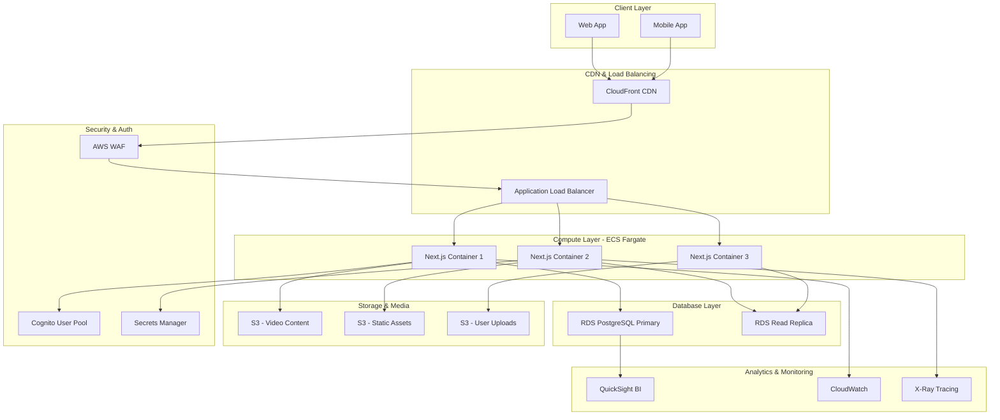

# AWS Architecture for SkillNexus LMS - 10,000+ Users

## Mermaid Architecture Diagram

## AWS Services Architecture Summary

### 🚀 **Compute & Hosting**
- **AWS ECS Fargate**: Auto-scaling containerized Next.js apps
- **Application Load Balancer**: Traffic distribution across containers
- **Auto Scaling**: Scale 2-20 containers based on CPU/memory

### 🗄️ **Database & Storage**
- **Amazon RDS PostgreSQL**: Multi-AZ deployment for high availability
- **Read Replicas**: 2-3 replicas for read-heavy operations
- **Amazon S3**: 3 buckets for videos, assets, and user uploads
- **CloudFront**: Global CDN for video streaming and static content

### 📊 **Analytics & Business Intelligence**
- **Amazon QuickSight**: Real-time dashboards and reports
- **CloudWatch**: Application monitoring and alerting
- **AWS X-Ray**: Distributed tracing for performance optimization

### 🔒 **Security & Compliance**
- **AWS WAF**: Web application firewall protection
- **AWS Cognito**: User authentication and authorization
- **AWS Secrets Manager**: Secure credential management
- **VPC**: Isolated network with private subnets

## Cost Optimization Strategy

### 💰 **Estimated Monthly Costs (10,000+ users)**
- **ECS Fargate**: $200-400 (2-8 containers)
- **RDS PostgreSQL**: $150-300 (db.r5.large Multi-AZ)
- **S3 + CloudFront**: $100-200 (video storage & CDN)
- **QuickSight**: $50-100 (business users)
- **Total**: ~$500-1000/month

### 🎯 **Performance Targets**
- **Response Time**: <200ms API responses
- **Video Streaming**: <2s initial load time
- **Availability**: 99.9% uptime SLA
- **Concurrent Users**: 1,000+ simultaneous video streams

## Implementation Phases

### Phase 1: Core Infrastructure (Week 1-2)
1. ECS Fargate cluster setup
2. RDS PostgreSQL Multi-AZ
3. S3 buckets and CloudFront

### Phase 2: Monitoring & Analytics (Week 3)
1. CloudWatch dashboards
2. QuickSight integration
3. X-Ray tracing setup

### Phase 3: Security Hardening (Week 4)
1. WAF rules implementation
2. Cognito user pool migration
3. Secrets Manager integration